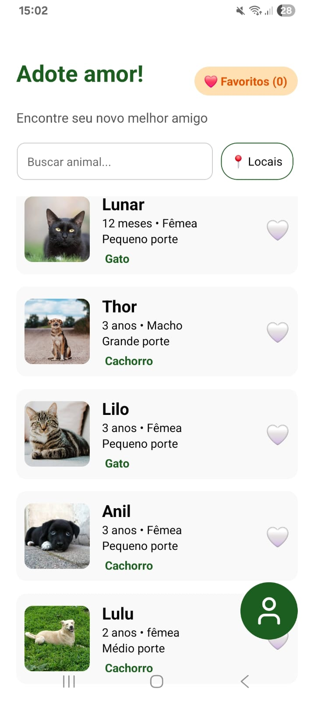
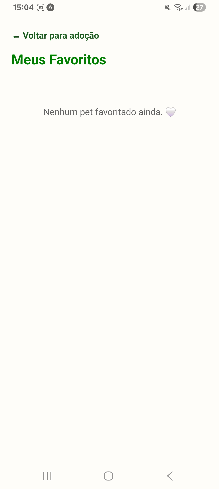
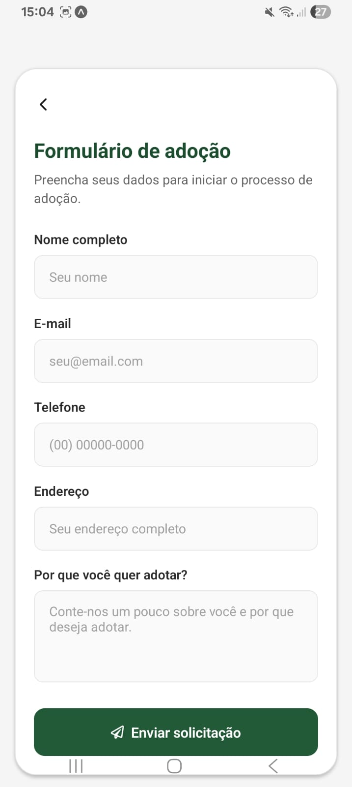
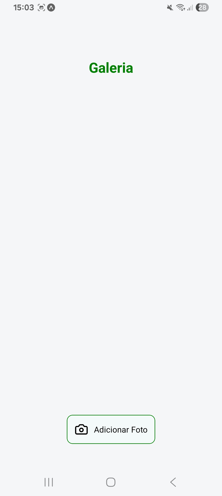
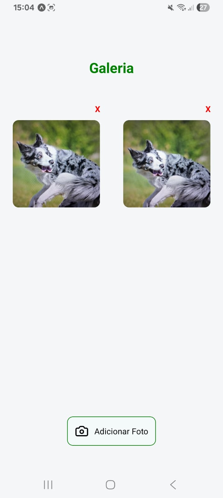
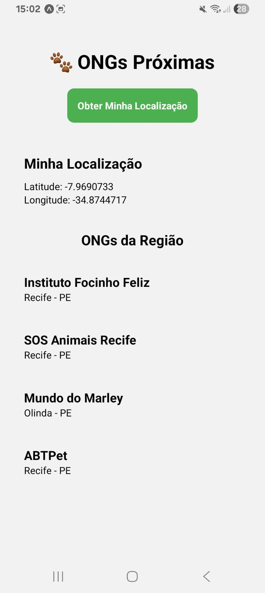
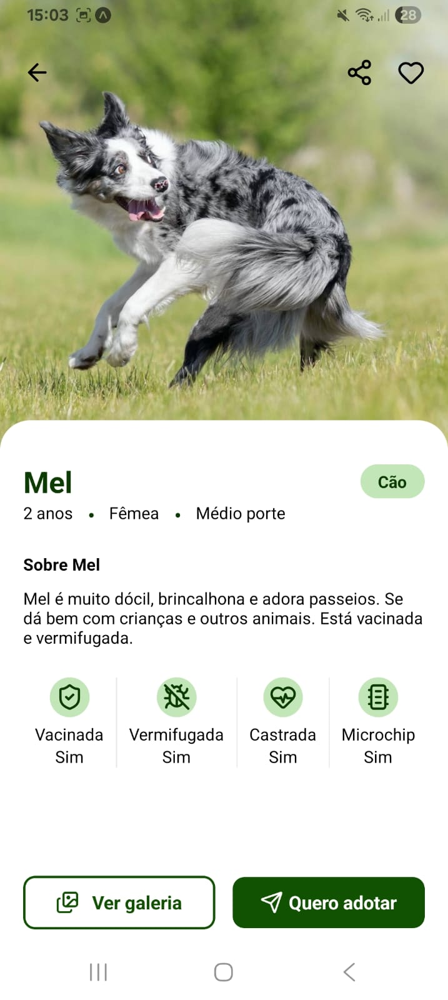

# App de Adoção de Pets
O App de Adoção de Pets é uma aplicação mobile desenvolvida com React Native que conecta pessoas interessadas em adotar animais a ONGs e abrigos. O aplicativo permite visualizar pets disponíveis para adoção, acessar informações detalhadas, adicionar fotos utilizando câmera, localizar instituições próximas por geolocalização, salvar favoritos, receber notificações e realizar solicitações de adoção por meio de uma interface intuitiva e moderna.

## Criação do arquivo
````
npm i -g expo-cli
npx create-expo-app@latest [nome da pasta] --template blank
````

## Funcionalidades implementadas
- Lista de animais para adoção
- Perfil detalhado de cada pet
- Câmera para adicionar fotos dos pets
- Geolocalização para ONGs próximas
- Formulário de adoção
- Notificações de novos pets
- Favoritos salvos localmente

## Tecnologias utilizadas
**ICONES**
````
npm install lucide-react-native
import { Camera } from 'lucide-react-native';
````

**Expo GO**

## Sensores implementados
**CAMERA**
````
npx expo install expo-image-picker
````

**GEOLOCALIZAÇÃO**

## Como instalar
```npm install```

## Como executar
````npx expo start````

## Screenshots do app funcionando
**Tela Principal com flatList de animais**


**Tela com favoritos**


**Formulario de adoção**


**Galeria e camera**



**Localização de Ongs proximas**


**Perfil dos animais**


**Perfil dos usuários**


## Nome completo e matrícula
- Bruna Freitas da Silva (01832048)
- João Fernando Marques Maciel Vieira (01859855)
- Maria Doralice Aragão Negromonte da Silva (01794484)
- Nicoly Gabriele da Silva (01864943)
- Pedro Ferreira da Rocha Falcão (01830497)
- Rian Pedro Alves de Farias (01850177)
- Sellena de Assis Ribeiro Lima (01862534)
